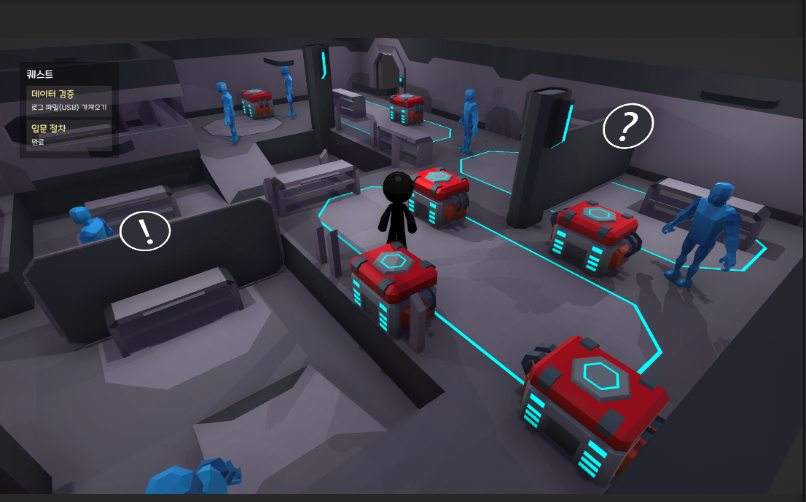
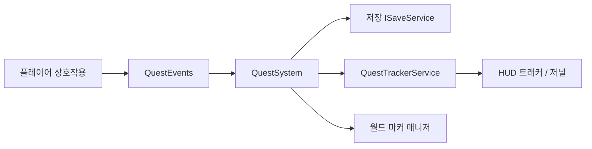

# Data-Driven-Interaction-Demo

3D 공간에서 **데이터(JSON)로 정의한 상호작용**과 **퀘스트 런타임**을 연결하는 Unity 데모입니다.  
UGUI·TMP 기반 HUD/저널/의뢰 UI, 로컬 저장 연동, (선택) Firebase·Photon 확장을 염두에 둔 구조입니다.

## 데모 영상

> 약 43초 · StartScene 로그인 → 퀘스트 수락 → 진행 → 보고·완료



**[▶ GitHub에서 데모 영상 재생](https://github.com/user-attachments/assets/0c7f7703-3479-4493-b606-1359198e8e22)** (새 탭에서 열림)

**시연 흐름**

1. **StartScene** — 이메일 로그인(Firebase Auth)
2. **DemoScene** — NPC 의뢰 수락, HUD 트래커·월드 마커 확인
3. **진행** — 대화·획득·터미널 제출로 목표 단계 완료
4. **저장** — PlayerPrefs 미러 + (선택) Firestore 복원

저장소 원본 MP4: `docs/데이터기반_상호작용_데모_퀘스트_시연.mp4`

## 목표

- 3D 탐색 + `IInteractable` 계열 상호작용(대화·획득·제출 등)
- **퀘스트 정의를 JSON으로 분리**하고 수락·진행·보고·완료 상태를 일관되게 관리
- 트래커·저널·의뢰 패널·월드 마커로 **진행 상황을 여러 채널에서 표현**
- Firebase(로그인/저장/랭킹)·Photon(멀티)는 **선택 연동**으로 두었으며, 코어는 오프라인에서도 재현 가능

## 구현된 핵심 기능

| 영역 | 내용 |
|------|------|
| **상호작용** | `InteractableBase` + `InteractableRegistry`(targetId 등록) → NPC·획득·터미널·의뢰 NPC 등 |
| **퀘스트** | `QuestSystem` — 수락 목록·진행 저장, Firestore 비동기 복원, 포기/전체 리셋, `QuestCatalog`(JSON) |
| **UI** | HUD **트래커**(`QuestTrackerListView`: 스크롤·텍스트 기준 **동적 너비**), **Q** 키 **저널**(`QuestJournalView`), **의뢰** 패널(`QuestOfferView`) |
| **월드** | `QuestObjectiveWorldMarkerManager` — 진행 목표(?) / 의뢰(!) 스프라이트 마커, `QuestFloatingMarker` 빌보드 |
| **데이터** | `Assets/Data/Json/quest_*.json` 샘플, 로더·후처리(`QuestDefinitionLoader`) |

Firebase·Photon·추가 랭킹 화면은 프로젝트 설정에 따라 **선택**입니다.

## 핵심 로직 흐름



한 줄 요약: 상호작용 → `QuestEvents` → `QuestSystem`이 런타임/저장을 갱신하고 → `QuestTrackerService`로 HUD/저널을 공유하며 → 트래커·월드 마커가 화면에 반영됩니다.

## 저장·복원 (Firebase, 선택)

`StartScene`에서 Firebase Auth 로그인 후 `FirebaseSaveInstaller`가 `SaveServices.QuestSave`를 **Firestore**로 연결합니다. `DemoScene`의 `QuestSystem`은 **시작 시 비동기로** 수락 목록·퀘스트 진행을 불러온 뒤(`IsHydrated`) HUD·저널·월드 마커를 갱신합니다.

### Firestore 데이터 구조

로그인 uid 기준 경로입니다.

| 경로 | 내용 |
|------|------|
| `users/{uid}/quests/{questId}` | 필드 `json` — 퀘스트 진행(`stepIndex`, `stepCount` 등) |
| `users/{uid}/saves/quest_meta` | 필드 `accepted` — 수락한 퀘스트 id (`quest_001\|quest_002` 형식) |

로컬에는 동일 내용의 **미러**(`PlayerPrefs`)가 있어 같은 기기에서 빠르게 읽을 수 있으며, **새 기기·PlayerPrefs 초기화 후**에도 Firestore에서 복원합니다.

### 메인 메뉴 Continue

`QuestDemoSaveHelper.HasAnySavedProgressAsync`로 **로컬 또는 Firestore**에 저장이 있으면 Continue를 활성화합니다. New Game·F12 리셋 시 카탈로그 기준으로 진행·수락 목록을 지웁니다.

### 저장·복원 검증 시나리오

| ID | 시나리오 | 준비 | 기대 결과 | 검증 |
|----|----------|------|-----------|------|
| **A** | 로컬 재시작 | 퀘스트 1개 수락·진행(예: 1/3) 후 Play 종료 → DemoScene 재진입 | HUD 트래커·진행도 동일 | PlayerPrefs 미러 |
| **B** | Continue | A 이후 StartScene → **Continue** | DemoScene에서 이전 진행 유지 | `HasAnySavedProgressAsync` |
| **C** | 클라우드 복원 | Firebase 로그인·진행 저장 후 **Edit → Clear All PlayerPrefs** → 동일 계정 재로그인 | 수락·진행이 Firestore 기준으로 복원 | Console `users/{uid}/quests`, `saves/quest_meta` |
| **D** | 초기화 | **New Game** 또는 F12(디버그 리셋) | 수락·진행·트래커 비움 | 카탈로그 기준 삭제 |
| **E** | (선택) 새 기기 | C와 동일 흐름을 빌드·다른 PC에서 | 로컬 없이도 C와 동일 | Firestore만 신뢰 |

**자동 테스트 (Edit Mode)**  
**Window → General → Test Runner → EditMode** → `QuestSystemTests`  
수락·픽업 진행·제출 완료·**PlayerPrefs 복원(Hydrate)**·Interactable Registry — 로직 회귀 방지용(Play 전체 플로우 대체 아님).

**시나리오 C 상세**

1. 퀘스트 수락·진행 후 Firestore **데이터**에서 `users/{uid}/quests`, `saves/quest_meta` 생성을 확인합니다.
2. Unity **Edit → Clear All PlayerPrefs** 후 같은 계정으로 StartScene 로그인 → DemoScene Play 합니다.
3. HUD 트래커·저널·월드 마커가 이전과 같으면 `QuestSystem` 비동기 hydrate(`IsHydrated`)가 정상입니다.

수동 검증 체크리스트: [docs/TEST_CHECKLIST.md](docs/TEST_CHECKLIST.md)

### Firestore 보안 규칙 (예시)

본인 uid만 읽기·쓰기:

```javascript
rules_version = '2';
service cloud.firestore {
  match /databases/{database}/documents {
    match /users/{userId}/{document=**} {
      allow read, write: if request.auth != null && request.auth.uid == userId;
    }
  }
}
```

### Firebase 설정 파일 (로컬)

저장소에는 **샘플만** 포함합니다. 클론 후 아래를 복사해 Firebase Console에서 받은 값으로 채웁니다.

| 샘플 | 복사 후 파일명 |
|------|----------------|
| `Assets/StreamingAssets/google-services-desktop.json.sample` | `Assets/StreamingAssets/google-services-desktop.json` |
| `Assets/google-services.json.sample` | `Assets/google-services.json` |

실제 `google-services*.json`은 `.gitignore` 대상입니다. 이미 Git에 올라간 경우 `git rm --cached`로 추적만 해제합니다.

## 아키텍처·런타임

- **`GameplaySceneContext`**: DemoScene의 `QuestSystem`·HUD·저널·월드 마커 참조 허브(씬당 Find 1회). 선택 필드로 `QuestOfferView`·`ProximityInteractor`를 연결하면 Find 폴백을 더 줄일 수 있습니다.
- **`QuestTrackerService` / `SaveServices`**: 데모용 static 레지스트리(HUD 데이터·저장 구현 교체).
- **월드 마커**: `QuestObjectiveWorldMarkerManager`가 anchor별로 풀링·`SetActive` 재사용.

자세한 씬·저장 설정은 [docs/QUEST_DEMO.md](docs/QUEST_DEMO.md)를 참고합니다.

## 기술 스택

- **Unity**: 6000.4.2f1 (프로젝트 설정 기준)
- **UI**: UGUI, TextMeshPro
- **데이터**: JSON(TextAsset + `JsonUtility` 등)
- **Backend(선택)**: Firebase, Photon

## 빠른 실행

1. Unity Hub에서 이 폴더를 프로젝트로 연 뒤 **`Assets/Scenes/DemoScene`**을 엽니다.
2. **Play**를 누르면 플레이어 이동·근접 상호작용이 씬에 구성된 컨트롤러·트리거에 따라 동작합니다.
3. 퀘스트·의뢰 UI가 씬에 없다면 [docs/QUEST_DEMO.md](docs/QUEST_DEMO.md)의 **에디터 메뉴** 절에 따라 `Build Quest Offer UI`, `Wire Quest Offer + npc_010 Giver` 등을 실행합니다.

### 플레이 힌트

| 입력 | 동작 |
|------|------|
| **E** | 프롬프트가 있을 때 상호작용 |
| **Q** | 퀘스트 저널 열기/닫기 (`QuestHudView` 옵션) |
| **F12** | `QuestDebugAccepter`가 있을 때 퀘스트·저장 일괄 리셋 |

## 문서

- **퀘스트·의뢰·마커·씬 체크리스트**: [docs/QUEST_DEMO.md](docs/QUEST_DEMO.md)
- **레거시 코드**: [docs/LEGACY.md](docs/LEGACY.md)
- **테스트**: [docs/TEST_CHECKLIST.md](docs/TEST_CHECKLIST.md) (수동 + Edit Mode `QuestSystemTests`)
- **CI (GitHub Actions)**: [docs/CI.md](docs/CI.md)

## 데모·보안 (StartScene)

- **Google 로그인**: 기본적으로 비표시입니다(`showGoogleSignIn`, `showGoogleSignInInDemo`). 필요 시 인스펙터에서 활성화할 수 있습니다.
- **이메일 비밀번호**: PlayerPrefs에 저장하지 않습니다. 로그인 상태는 **Firebase Auth 세션**만 사용합니다.

## 검증 요약

저장·복원: 로컬 재시작(A)·Continue(B)·PlayerPrefs 삭제 후 Firestore 복원(C) 수동 확인, Edit Mode `QuestSystemTests` 5건 통과.

## 라이선스·서드파티

써드파티 에셋은 각 패키지 라이선스를 따릅니다. 배포 시 포함 여부를 확인합니다.
