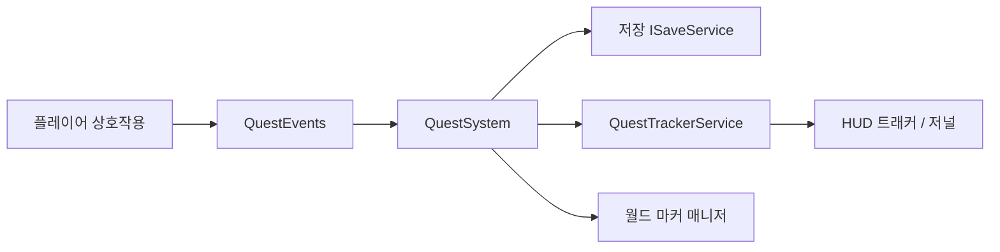

# Data-Driven-Interaction-Demo

3D 공간에서 **데이터(JSON)로 정의한 상호작용**과 **퀘스트 런타임**을 연결하는 Unity 데모입니다.  
UGUI·TMP 기반 HUD/저널/의뢰 UI, 로컬 저장 연동, (선택) Firebase·Photon 확장을 염두에 둔 구조입니다.

## 데모 영상

## 목표

- 3D 탐색 + `IInteractable` 계열 상호작용(대화·획득·제출 등)
- **퀘스트 정의를 JSON으로 분리**하고 수락·진행·보고·완료 상태를 일관되게 관리
- 트래커·저널·의뢰 패널·월드 마커로 **진행 상황을 여러 채널에서 표현**
- Firebase(로그인/저장/랭킹)·Photon(멀티)는 **선택 연동**으로 두었으며, 코어는 오프라인에서도 재현 가능

## 구현된 핵심 기능

| 영역 | 내용 |
|------|------|
| **상호작용** | `InteractableBase` → `NpcInteractable`, `ItemPickupInteractable`, `TerminalSubmitInteractable`, `QuestGiverInteractable` 등 |
| **퀘스트** | `QuestSystem` — 수락 목록 저장, 이벤트 기반 진행, 포기/전체 리셋, `QuestCatalog`(JSON) |
| **UI** | HUD **트래커**(`QuestTrackerListView`: 스크롤·텍스트 기준 **동적 너비**), **Q** 키 **저널**(`QuestJournalView`), **의뢰** 패널(`QuestOfferView`) |
| **월드** | `QuestObjectiveWorldMarkerManager` — 진행 목표(?) / 의뢰(!) 스프라이트 마커, `QuestFloatingMarker` 빌보드 |
| **데이터** | `Assets/Data/Json/quest_*.json` 샘플, 로더·후처리(`QuestDefinitionLoader`) |

Firebase·Photon·추가 랭킹 화면은 프로젝트 설정에 따라 **선택**입니다.

## 핵심 로직 흐름

한 줄 요약: 상호작용 → `QuestEvents` → `QuestSystem`이 런타임/저장을 갱신하고 → `QuestTrackerService`로 HUD/저널을 공유하며 → 트래커·월드 마커가 화면에 반영됩니다.

## 기술 스택

- **Unity**: 6000.4.2f1 (프로젝트 설정 기준)
- **UI**: UGUI, TextMeshPro
- **데이터**: JSON(TextAsset + `JsonUtility` 등)
- **Backend(선택)**: Firebase, Photon

## 빠른 실행

1. Unity Hub에서 이 폴더를 프로젝트로 연 뒤 **`Assets/Scenes/DemoScene`**을 엽니다.
2. **Play**를 누르면 플레이어 이동·근접 상호작용이 씬에 구성된 컨트롤러·트리거에 따라 동작합니다.
3. 퀘스트·의뢰 UI가 씬에 없다면 [docs/QUEST_DEMO.md](docs/QUEST_DEMO.md)의 **에디터 메뉴** 절에 따라 `Build Quest Offer UI`, `Wire Quest Offer + npc_010 Giver` 등을 실행합니다.

### 플레이 힌트

| 입력 | 동작 |
|------|------|
| **E** | 프롬프트가 있을 때 상호작용 |
| **Q** | 퀘스트 저널 열기/닫기 (`QuestHudView` 옵션) |
| **F12** | `QuestDebugAccepter`가 있을 때 퀘스트·저장 일괄 리셋 |

## 문서

- **퀘스트·의뢰·마커·씬 체크리스트**: [docs/QUEST_DEMO.md](docs/QUEST_DEMO.md)
- **레거시 코드**: [docs/LEGACY.md](docs/LEGACY.md)

## 데모·보안 (StartScene)

- **Google 로그인**: 기본적으로 비표시입니다(`showGoogleSignIn`, `showGoogleSignInInDemo`). 필요 시 인스펙터에서 활성화할 수 있습니다.
- **이메일 비밀번호 기억**: 기본값은 **꺼짐**입니다. 활성화 시 `PlayerPrefs`에 평문에 가깝게 저장되며, **데모·개발용**입니다. 배포 시에는 Firebase Auth 등 정식 인증을 사용합니다.

## 라이선스·서드파티

써드파티 에셋은 각 패키지 라이선스를 따릅니다. 배포 시 포함 여부를 확인합니다.
